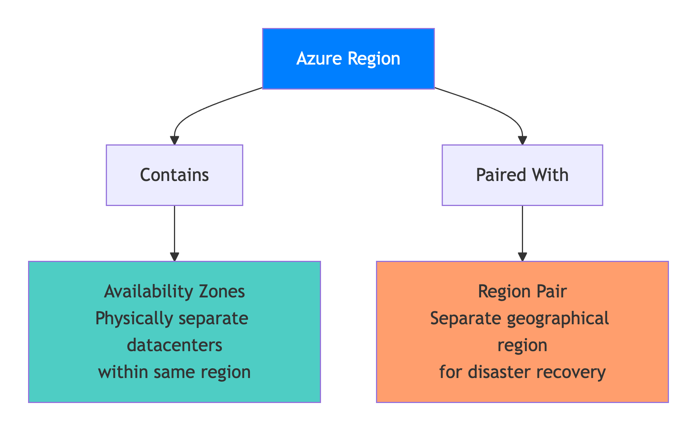

# PART I — Azure & Cloud First Principles

### Chapter 1 – Thinking Like an Azure Architect

***

* [ ] 1.1 Role of an Azure Architect
* [ ] 1.2 Azure Global Infrastructure (Regions, AZs, Pairs)
* [ ] 1.3 Control Plane vs Data Plane
* [ ] 1.4 Shared Responsibility Model
* [ ] 1.5 Azure Resource Hierarchy & Governance
* [ ] 1.6 Azure Well-Architected Framework
* [ ] 1.7 Architect Failure Case Studies
* [ ] 1.8 Architecture Decision Checklists
* [ ] 1.9 Interview Questions & Traps

***

1.1 Role of an Azure Architect

#### What an Azure Architect _actually_ does (not job-description fluff)

An Azure Architect is **accountable for decisions**, not just diagrams.

You are responsible for:

* **System correctness under failure**
* **Cost predictability**
* **Security posture**
* **Operational simplicity**
* **Future change tolerance**

In real enterprises, the architect sits at the intersection of:

* Business constraints
* Engineering realities
* Cloud provider limits
* Human operational behavior

#### Core Responsibilities (Real-World)

<table><thead><tr><th width="308.2890625">Area</th><th>What It Means in Practice</th></tr></thead><tbody><tr><td>Architecture Design</td><td>Choosing <em>what not to build</em> as much as what to build</td></tr><tr><td>Technology Selection</td><td>Picking Azure services that teams can actually operate</td></tr><tr><td>Non-Functional Requirements</td><td>Latency, availability, scalability, security</td></tr><tr><td>Governance</td><td>Preventing chaos before it happens</td></tr><tr><td>Failure Planning</td><td>Designing for 2 AM incidents</td></tr><tr><td>Cost Control</td><td>Preventing “cloud bill shock”</td></tr><tr><td>Communication</td><td>Translating business goals → technical systems</td></tr></tbody></table>

#### Azure Architect vs .NET Architect

| .NET Architect                   | Azure Architect              |
| -------------------------------- | ---------------------------- |
| Focuses on application internals | Focuses on system boundaries |
| Code-centric                     | Platform-centric             |
| Frameworks & patterns            | Services, limits, quotas     |
| Unit testing                     | Chaos & failure testing      |

A **great Azure Architect** understands .NET deeply, but **thinks in distributed systems**.

1.2 Azure Global Infrastructure

#### Regions, Availability Zones, Region Pairs

Azure’s infrastructure decisions directly impact:

* SLA
* Latency
* Compliance
* Disaster recovery cost

<figure><figcaption></figcaption></figure>

#### Azure Regions

* A **Region** = geographical area with multiple datacenters
* Example: _Central India, East US, West Europe_

Key rule:

> _**You deploy to regions, not to “Azure” generically**_

<figure><figcaption></figcaption></figure>

#### Availability Zones (AZs)

* Physically separate datacenters **within the same region**
* Independent power, cooling, networking

Used for:

* Mission-critical workloads
* High availability inside a region

Example:

* App Service across 3 AZs
* SQL Managed Instance zone-redundant

<figure><figcaption></figcaption></figure>

#### Region Pairs

Azure pairs regions for **disaster recovery**.

Rules:

* Updates roll out one region at a time
* Data residency respected
* At least 300 miles separation

Examples:

* Central India ↔ South India
* East US ↔ West US

<figure><figcaption></figcaption></figure>

#### Real Production Decision

* **AZs** → protect from datacenter failure
* **Region pairs** → protect from regional disasters

<figure><figcaption></figcaption></figure>



## Availability Zones

### Azure fault domain and update domain

An _<mark style="color:$tint;">**Availability Zone**</mark>_ is a combination of a **fault domain** and an **update domain**. For example, if you create three VMs across three zones in an Azure region, your VMs are effectively distributed across three fault domains and three update domains.

For some reason, if there is a power failure or power surge, equipment failure or some other fault in Availability Zone 1, only Availability Zone 1 is affected. As the availability zones are physically separted from each other, faults from one availability zone are not spread to the other availability zones. Since, in this example, we have 3 availability zones, it's like we have 3 separate fault domains. If there is a fault and Availability Zone 1 is down, we still have our VM available from the rest of the two fault domians i.e Availability Zones 2 and 3.

### _`Azure Zonal services and Zone-redundant service`_&#x2060; 

If you want to make the best use of availability zones and build high-availability systems, you will have to identify your compute, storage, networking, and data resources within an availability zone and replicate them in the other availability zones. Azure services that support Availability Zones are classified into two categories:

.png>)⁠ 

### `Zonal services`&#x20;

Virtual machine is an example of a zonal service. A zonal service is pinned to a specific availability zone. This means it is only available in the availability zone where it is created. It is not automaically replicated to other availability zones. So, if want to build highly-available systems, identify zonal services, such as a VM for example and replicate them in other availability zones. Other examples of zonal services are managed disks and Standard IP addresses.⁠ 

**`Zone-redundant services`**` ``-`

Azure SQL Database is an example of zone-redundant service. These zone-redundant services are automatically replicated by the Azure platform across all availability zones. Unlike Zonal services, we don't have to replicate them manually.

### What are Azure paired regions

Azure regional pair, paired regions, or region pair, all these terms are used interchangeably and they refer to the same thing, i.e a pair of azure regions. So in simple terms, a regional pair consists of two regions within the same geography.

<figure><figcaption></figcaption></figure>

As you can see from the image, at the highest level we have an Azure Geography. As we have already discussed, an Azure geography is an area of the world that contains one or more Azure Regions. For example, India, United States, Europe, Asia Pacific are a few examples of Azure Geographies.

<figure><figcaption></figcaption></figure>

An azure region is made up of one or more datacenters. If availability zones are enabled, an azure region contains a minimum of three availability zones. An Availability Zone is made up of one or more datacenters. So the point is, an Azure region contains one or more datacenters or 3 or more availability zones if enabled.

Most regions in a geography are paired to ensure business continuity and disaster recovery (BCDR). The following are a few examples of azure paired regions. For the complete list of Azure paired regions, please check out the Microsoft official docs.

<figure><figcaption></figcaption></figure>

A regional pair consists of two regions within the same geography. However, there is one exception to this. Brazil South region is paired with South Central US region, which obviously, is outside of Brazil's geography.

<figure><figcaption></figcaption></figure>



1.3 Control Plane vs Data Plane

This distinction is **critical for security and debugging**.

#### Control Plane

* Management operations
* ARM, Portal, CLI, Terraform
* Create/update/delete resources

Examples:

* Creating a Web App
* Scaling an App Service Plan
* Updating Key Vault policies

#### Data Plane

* Actual application data flow
* Runtime traffic
* User requests

Examples:

* HTTP requests to API
* SQL queries
* Blob uploads

#### Why Architects Care

| Scenario                      | Plane         |
| ----------------------------- | ------------- |
| ARM permission issue          | Control Plane |
| API returning 500             | Data Plane    |
| App runs but deployment fails | Control Plane |
| Users can’t access data       | Data Plane    |

**Interview trap**:\
Many candidates mix RBAC (control plane) with application auth (data plane).

<figure><figcaption></figcaption></figure>

1.4 Shared Responsibility Model (Azure)

#### What this really means

**Using Azure does NOT mean Microsoft handles everything.**\
It means **responsibility is split** between Microsoft (Azure) and **you (the customer)**.

Azure secures **the cloud**.\
You secure **what you put in the cloud**.

This distinction is one of the **most misunderstood—and most critical—concepts** in cloud architecture.

***

### Responsibility Split — Explained Simply

| Layer                 | Who is Responsible | What it Means in Real Life                 |
| --------------------- | ------------------ | ------------------------------------------ |
| **Datacenter**        | Azure              | Physical buildings, guards, power, cooling |
| **Physical Network**  | Azure              | Cables, switches, routers                  |
| **Host OS**           | Azure              | OS running on Azure servers                |
| **Guest OS (VM)**     | You                | Windows/Linux inside your VM               |
| **Runtime**           | You                | .NET, Java, Node versions & patching       |
| **Application**       | You                | Your APIs, logic, validations              |
| **Identity & Access** | You                | Users, roles, permissions                  |
| **Data**              | You                | Encryption, backups, access control        |

#### Key Rule to Remember

> **Anything you configure is your responsibility.**

Azure provides **secure defaults**, but it does **not enforce correctness** unless you explicitly configure it.

This layered view helps you **instantly recall** where Azure’s responsibility ends and yours begins—especially useful for **interviews, reviews, and incident analysis**.


“Azure secures the platform and infrastructure, but identity, configuration, and data security always remain the customer’s responsibility.”


***

### Why This Matters in the Real World

#### Common Incident Statement

> “Azure was hacked.”

#### What actually happened (almost always)

* Storage account set to **public**
* IAM roles given **Contributor** instead of **Reader**
* No **Private Endpoint / VNet restriction**
* No **logging or alerts**
* No **Azure Policy enforcement**

Azure infrastructure was secure.\
**The configuration was not.**

***

### Real-World Example (Very Common)

#### Scenario: Blob Storage Breach

What Azure did:

* Secured the datacenter
* Secured the storage service itself

What the customer did:

* Enabled public access
* Stored sensitive data
* No access monitoring

**Result**: Data leak\
**Root cause**: Customer responsibility failure

***

### Why Cloud “Amplifies” Mistakes

| On-Prem          | Cloud                       |
| ---------------- | --------------------------- |
| Limited exposure | Internet-scale exposure     |
| Manual access    | API-driven access           |
| Slower failures  | Instant failures            |
| Fewer attackers  | Constant automated scanning |

A **small mistake** in cloud becomes a **large incident very fast**.

***

### Architect-Level Mental Model

Think of Azure like this:

> _<mark style="color:$info;">**Azure gives you a perfectly built apartment building.**</mark>_\
> _<mark style="color:$info;">**If you leave your door open, that’s on you.**</mark>_

1.5 Azure Resource Hierarchy &#x26; Governance

Think of Azure like a **company structure**.\
Each level exists to **control blast radius, cost, access, and lifecycle**.

<figure><figcaption></figcaption></figure>

***

<figure><figcaption></figcaption></figure>

### 1️⃣ Management Groups

#### What it is (Simple)

A **container for subscriptions** used only for **enterprise-wide governance**.

You **do not deploy applications here**.

#### Real Example

Your company has:

* Dev subscriptions
* QA subscriptions
* Prod subscriptions

You create:

* `Org-Root`
  * `Non-Prod`
  * `Prod`

At the **Management Group level**, you enforce:

* Security rules
* Compliance rules
* Allowed regions

#### Why Architects Use It

* One rule → applies to **all subscriptions**
* Prevents teams from bypassing governance

**Used for:**\
✔ Enterprise governance\
✔ Compliance\
✔ Guardrails

***

### 2️⃣ Subscriptions

#### What it is

A **billing and isolation boundary**.

#### Real Example

* `clarifin-dev-subscription`
* `clarifin-prod-subscription`

If **prod goes wrong**, dev is unaffected.

#### Why This Matters

* Separate billing
* Separate access control
* Separate quotas & limits

#### Architect Rule

> One subscription per environment is the safest default.

**Used for:**\
✔ Billing\
✔ Access isolation\
✔ Environment separation

<figure><figcaption></figcaption></figure>

***

### 3️⃣ Resource Groups

#### What it is

A **logical container** for related resources that **live and die together**.

#### Real Example

Resource Group: `rg-clarifin-api-prod`

Contains:

* App Service
* SQL Database
* Application Insights
* Key Vault

If you delete the resource group → **everything is deleted together**.

#### Why Architects Love Resource Groups

* Easy cleanup
* Clear ownership
* Deployment boundary

**Used for:**\
✔ Lifecycle management\
✔ Deployment scope\
✔ Ownership clarity

***

### 4️⃣ Resources

#### What it is

The **actual Azure services**.

Examples:

* App Service
* Virtual Machine
* Storage Account
* SQL Database

#### Real Example

* `clarifin-api-appservice`
* `clarifin-sql-db`

This is where your **application actually runs**.

**Used for:**\
✔ Running workloads\
✔ Storing data\
✔ Serving traffic

***

## Why This Hierarchy Matters (In Real Life)

| Level            | Real-World Purpose        |
| ---------------- | ------------------------- |
| Management Group | Enforce org-wide security |
| Subscription     | Control cost & access     |
| Resource Group   | Manage lifecycle          |
| Resource         | Run the system            |

If this structure is wrong:

* Security leaks happen
* Costs spiral
* Cleanup becomes impossible

***

## Governance Pillars (This Prevents Disaster)

Governance = **rules that stop humans from making costly mistakes**

***

### 1️⃣ Azure Policy

#### What it does

**Prevents bad configurations before they happen**.

#### Real Examples

* ❌ Block public IP creation
* ❌ Block resources outside India region
* ✅ Enforce mandatory tags like `Owner`, `Environment`

#### Example Scenario

Developer tries to:

* Create a public storage account

Azure Policy:

* **Blocks it immediately**

No manual review needed.

***

### 2️⃣ RBAC (Role-Based Access Control)

#### What it does

Controls **who can do what**.

#### Real Example

| Role      | Access      |
| --------- | ----------- |
| Developer | Deploy apps |
| QA        | Read logs   |
| Admin     | Full access |

#### Architect Rule

> Never give **Contributor** when **Reader** is enough.

RBAC mistakes are the **#1 cause of breaches**.

***

### 3️⃣ Naming & Tagging

#### What it is

A **discipline**, not decoration.

#### Mandatory Tags (Real World)

* `Environment` → dev / prod
* `Owner` → team name
* `CostCenter` → finance mapping

#### Why This Matters

* Finance can track cost
* Auditors can trace ownership
* Automation scripts work reliably

**Without tags**:

* Bills are untraceable
* No accountability
* No automation

***

## Architect Golden Rule

> **If governance is added later, it will fail.**

#### Why?

* Teams resist restrictions
* Existing resources violate rules
* Cleanup becomes risky and political

#### Correct Approach

1. Define hierarchy first
2. Apply policies early
3. Lock down access
4. Then allow teams to build


> _**Management Groups**_ enforce governance, subscriptions isolate billing and access, resource groups manage lifecycle, and resources run workloads—governance must be designed before development begins.

***


1.6 Azure Well-Architected Framework (WAF)

> This is Azure’s **architecture bible** because it answers one question:\
> &#xNAN;**“Will this system survive real users, real failures, and real growth?”**

### The 5 Pillars — with Real Examples

<table><thead><tr><th width="279.36328125">Pillar</th><th>Core Question</th></tr></thead><tbody><tr><td><strong>Reliability</strong></td><td>What happens when it fails?</td></tr><tr><td><strong>Security</strong></td><td>How do we prevent &#x26; detect abuse?</td></tr><tr><td><strong>Cost Optimization</strong></td><td>Are we wasting money?</td></tr><tr><td><strong>Operational Excellence</strong></td><td>Can humans operate this system?</td></tr><tr><td><strong>Performance Efficiency</strong></td><td>Is it fast enough under load?</td></tr></tbody></table>

_We’ll apply each one to a **real .NET API platform**._

<figure><figcaption></figcaption></figure>

## <mark style="color:$tint;">**1. Reliability**</mark>

#### _“What happens when it fails?”_

Failures **will happen**:

* Network glitches
* Downstream service outage
* Temporary Azure service issues

#### Real Example (API → Database)

**Problem**\
Your .NET API calls Azure SQL.\
SQL has a brief throttling issue.

**Bad Design**

* API crashes
* User gets 500 error
* Retry storm starts

**Good Design**

* Retry policy
* Circuit breaker
* Graceful fallback

#### How You Implement in .NET

* Polly retries (exponential backoff)
* Circuit breakers
* Timeout handling

**Result**

* Small failures stay small
* System degrades gracefully

> #### <mark style="color:$tint;">Reliability is about</mark> <mark style="color:$tint;"></mark><mark style="color:$tint;">**containing failure**</mark><mark style="color:$tint;">, not eliminating it.</mark>

***

## <mark style="color:$tint;">**2. Security**</mark>

#### _“How do we prevent & detect abuse?”_

Security is **not just firewalls**.\
It’s **identity, access, and visibility**.

#### Real Example (Secrets & Access)

**Bad Practice**

* Store DB password in `appsettings.json`
* Public endpoint to database
* Static credentials

**Good Practice**

* Managed Identity
* Private Endpoint
* Azure Key Vault

#### Real Flow

1. API authenticates using **Managed Identity**
2. No secrets stored in code
3. Database accessible only via private network

**Result**

* No leaked credentials
* Reduced attack surface
* Easier compliance

> #### <mark style="color:$tint;">Most Azure breaches are</mark> <mark style="color:$tint;"></mark><mark style="color:$tint;">**identity misconfigurations**</mark><mark style="color:$tint;">, not hacks</mark>

***

## <mark style="color:$tint;">**3. Cost Optimization**</mark>

#### _“Are we wasting money?”_

Cloud waste is **silent** until finance complains.

#### Real Example (API Traffic Pattern)

* High traffic: 9 AM – 9 PM
* Near zero traffic at night

**Bad Design**

* Fixed-size VMs running 24×7

**Good Design**

* App Service auto-scale
* Scale-to-zero for background jobs
* Reserved Instances for predictable load

#### Result

* Pay only when users exist
* Predictable billing
* No surprise invoices

> #### <mark style="color:$tint;">**Cost optimization is an architecture decision, not a finance task.**</mark>

***

## 4. Operational Excellence

#### _“Can humans operate this system?”_

If only the original developer can fix it → **bad architecture**.

#### Real Example (Production Incident at 2 AM)

**Without Ops Design**

* No logs
* No metrics
* No alerts
* Blind debugging

**With Ops Design**

* Application Insights
* Structured logging
* Health checks
* Alert rules

#### What You See

* Request failure rate
* Dependency latency
* Exception stack traces
* Correlation IDs

**Result**

* Faster incident resolution
* Lower stress
* Happier teams

> #### <mark style="color:$tint;">A system that cannot be observed</mark> <mark style="color:$tint;"></mark><mark style="color:$tint;">**cannot be trusted**</mark><mark style="color:$tint;">.</mark>

***

## 5. Performance Efficiency

#### _“Is it fast enough under load?”_

Performance is about **serving more users with fewer resources**.

#### Real Example (High Read Traffic API)

**Problem**

* Same data requested repeatedly
* Database becomes bottleneck

**Solution**

* In-memory cache
* Redis cache
* Async I/O

#### .NET Best Practices

* Async/await everywhere
* Avoid thread blocking
* Cache hot paths
* Use CDN for static content

**Result**

* Faster response times
* Lower database cost
* Higher throughput

> Performance is about **efficiency**, not raw power.

***

<figure><figcaption></figcaption></figure>

***

### Full API Platform Mapping (At a Glance)

<table><thead><tr><th width="203.62109375">Pillar</th><th>What You Actually Do</th></tr></thead><tbody><tr><td><em><mark style="color:$tint;"><strong>Reliability</strong></mark></em></td><td>Retries, circuit breakers, health probes</td></tr><tr><td><em><strong>Security</strong></em></td><td>Managed Identity, private endpoints</td></tr><tr><td><em><strong>Cost</strong></em></td><td>Auto-scale, scale-to-zero, reservations</td></tr><tr><td><em><strong>Operations</strong></em></td><td>Logs, metrics, alerts</td></tr><tr><td><em><strong>Performance</strong></em></td><td>Caching, async I/O</td></tr></tbody></table>

***

### Architect Golden Principle

> **If even one pillar is ignored, the system will eventually fail.**

Most production outages are not bugs—they are **architectural blind spots**.


“The _**Azure Well-Architected Framework**_ ensures reliability, security, cost efficiency, operational clarity, and performance by design—not as an afterthought.”


1.7 Architect Failure Case Studies (Azure)

### ✅ <mark style="color:$tint;">**Case 1:**</mark><mark style="color:$tint;">**&#x20;**</mark>_<mark style="color:$tint;">**Single Region Deployment**</mark>_

#### Failure (What Happened)

Think of a **shop with only one branch**.

* App deployed only in **Central India**
* Azure region outage happened
* Entire business stopped instantly

<figure><figcaption></figcaption></figure> <figure><figcaption></figcaption></figure>

#### Why It Failed

* No secondary region
* No traffic routing
* No disaster recovery plan

#### Azure Services That Could Have Helped

* Azure Traffic Manager / Front Door
* Azure paired regions
* Geo-replicated databases

#### Correct Design (Simple)

* Run app in **two regions**
* Use **Traffic Manager** to route users
* Replicate data asynchronously

<figure><figcaption></figcaption></figure>

**Result**

* If Region A fails → traffic moves to Region B
* Users may feel slight delay, but **business survives**

&#x20;**Takeaway**

> High availability ≠ disaster recovery\
> **Regions fail. Architect for it.**

#### Architect Lesson

> **Availability inside one region does not protect against region failure**

***

### ✅ Case 2: Over-Engineered Microservices

#### Failure

A **5-member team running a 40-department company**.

* 40 microservices
* 5 developers
* No logging, no tracing

<figure><figcaption></figcaption></figure>

#### Symptoms

* Nobody knew which service failed
* One change broke many services
* Debugging took days

#### Azure Services Missing

* Application Insights
* Azure Monitor
* Service Map / tracing

#### Correct Design

* Start with **modular monolith**
* Split services only when needed
* Add observability _before_ scaling services

<figure><figcaption></figcaption></figure> <figure><figcaption></figcaption></figure>

**Result**

* Easier deployments
* Clear failure visibility
* Team can actually operate it

&#x20;**Takeaway**

> **Complexity must be earned, not assumed**

#### Architect Lesson

> **Microservices increase operational complexity, not reduce it**

***

### ✅ Case 3: Cost Explosion (Silent Killer)

#### Failure

Leaving **AC, lights, and TV ON 24×7**.

* Auto-scale misconfigured
* Logs retained forever
* No budget alerts

<figure><figcaption></figcaption></figure>

#### Outcome

* ₹4 lakh bill
* No increase in users

#### Azure Services to Control This

* Azure Cost Management
* Budgets & Alerts
* Log retention policies

#### Correct Design

* Set **budgets + alerts**
* Limit auto-scale max instances
* Retain logs only as needed

<figure><figcaption></figcaption></figure> <figure><figcaption></figcaption></figure>

**Result**

* Predictable cost
* No financial shock
* Finance trusts engineering

**Takeaway**

> **Every scale decision is a money decision**

#### Architect Lesson

> **Cost is an architectural concern, not a finance problem**

***

### ✅ Case 4: Public Storage Account Breach

#### Failure

Leaving your **house door open** and blaming the lock.

* Blob storage marked public
* Sensitive data exposed
* Internet bots found it

<figure><figcaption></figcaption></figure> <figure><figcaption></figcaption></figure>

#### Azure Controls Missing

* Azure Policy
* Private Endpoints
* Storage firewall rules

#### Correct Design

* Disable public access by policy
* Use private endpoints
* Enable access logging

**Result**

* Storage accessible only from your app
* Internet exposure eliminated

&#x20;**Takeaway**

> **Most breaches are configuration errors, not hacks**

#### Architect Lesson

> **Azure is secure by default—but configurable to insecure**

***

### ✅ Case 5: No Backup Strategy

#### Failure

Assuming **“Undo” exists in real life**.

* Azure SQL deleted accidentally
* No restore testing
* Backup expired

#### Azure Services Available

* Automated SQL backups
* Azure Backup
* Point-in-time restore

#### Correct Design

* Enable automated backups
* Test restore every quarter
* Store backups in separate region

**Result**

* Storage accessible only from your app
* Internet exposure eliminated

**Architect takeaway**

> **Most breaches are configuration errors, not hacks**

#### Architect Lesson

> **If you never tested restore, you don’t have backups**

***

### ✅ Case 6: VM-Based Design for Burst Traffic

#### Failure

Using a **tractor on a highway**.

* APIs on fixed VMs
* Traffic increased 10×
* VMs scaled too slowly

<figure><figcaption></figcaption></figure> <figure><figcaption></figcaption></figure>

#### Azure Services Better Suited

* App Service
* Azure Functions
* AKS (when mature)

#### Correct Design

* Use **PaaS for burst workloads**
* Let Azure auto-scale instantly
* Avoid VM-first thinking

<figure><figcaption></figcaption></figure> <figure><figcaption></figcaption></figure>

**Result**

* Instant scale-out
* No manual intervention
* Users stay happy

**Architect takeaway**

> **Use PaaS unless you have a strong reason not to**

#### Architect Lesson

> **Wrong compute choice breaks scalability**

***

### ✅ Case 7: No Health Checks

#### Failure

Patient is unconscious, but **doctor has no heartbeat monitor**.

* App hung internally
* Load Balancer still sent traffic
* Users kept failing

#### Azure Services Involved

* Azure Load Balancer
* App Service health checks
* Kubernetes probes (if AKS)

#### Correct Design

* Expose `/health` endpoint
* Use readiness & liveness checks
* Remove unhealthy instances automatically

#### Architect Lesson

> **Azure can’t detect failure you don’t expose**

***

### ✅ Case 8: Identity Misconfiguration

#### Failure

Giving **office master key to interns**.

* Developers had Contributor in prod
* Secrets deleted accidentally

#### Azure Security Tools

* RBAC
* Managed Identity
* Azure AD roles

#### Correct Design

* Read-only for most users
* Break-glass admin accounts
* Least privilege always

#### Architect Lesson

> **RBAC mistakes cause more outages than hackers**

***

### ✅ Case 9: No Observability

#### Failure

Flying a plane **without cockpit instruments**.

* App crashed randomly
* No logs, no metrics
* Blind debugging

#### Azure Observability Stack

* Application Insights
* Log Analytics
* Azure Monitor alerts

#### Correct Design

* Structured logs
* Correlation IDs
* Alerts for failures & latency

#### Architect Lesson

> **A system you can’t observe is a system you can’t operate**

***

### ✅ Case 10: Governance Added Too Late

#### Failure

Building a city **without rules or addresses**.

* No naming standards
* No tags
* No policies

#### After One Year

* Unknown ownership
* Costs untraceable
* Cleanup impossible

#### Azure Governance Tools

* Management Groups
* Azure Policy
* Mandatory tagging

#### Correct Design

* Define governance first
* Enforce policies early
* Standardize naming & tags

#### Architect Lesson

> **If governance is added later, it will fail**

***

### 🔹 Summary Table (Quick Revision)

| Case | Failure           | Correct Design          |
| ---- | ----------------- | ----------------------- |
| 1    | Single region     | Multi-region DR         |
| 2    | Too many services | Match team maturity     |
| 3    | No budgets        | Cost guardrails         |
| 4    | Public storage    | Policy + private access |
| 5    | No restore test   | Backup validation       |
| 6    | VM misuse         | PaaS for burst          |
| 7    | No health checks  | Health endpoints        |
| 8    | Weak RBAC         | Least privilege         |
| 9    | No monitoring     | Observability first     |
| 10   | Late governance   | Guardrails early        |

***

### Architect’s Golden Insight

> **Most cloud failures are not bugs.**\
> **They are architectural decisions made too early—or too late.**

1.8 Architecture Decision Checklists

#### Before Choosing Any Azure Service

Ask:

* What is the failure mode?
* What is the scaling unit?
* What is the cost driver?
* How do we monitor it?
* How do we secure it?
* How do we roll it back?

#### For .NET Applications

* Stateless?
* Async-friendly?
* Idempotent APIs?
* Config via environment?
* Health probes implemented?

1.9 Interview Questions &#x26; Traps

#### Common Questions

* Difference between AZ and Region?
* When to use VM vs App Service?
* How does Azure handle DR?
* Explain control vs data plane
* How do you secure secrets?

#### Traps to Avoid

* Saying “Azure handles security”
* Overusing microservices
* Ignoring cost
* Designing without failure scenarios

***

### Architect Principle

> **Architecture is not about diagrams.**\
> **It is about making irreversible decisions responsibly.**
