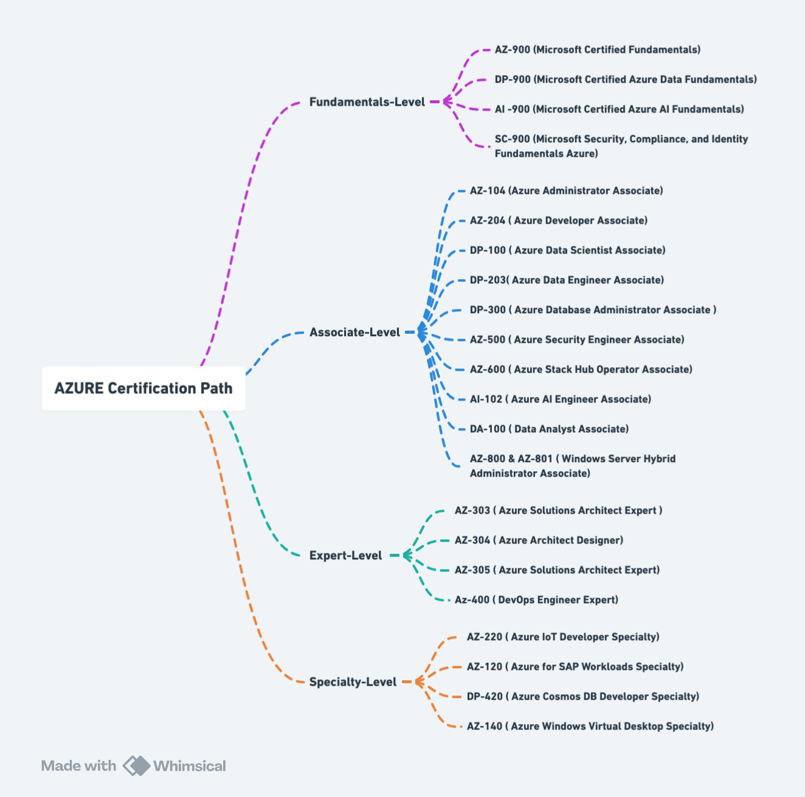

# Azure Functions (.NET 8) + HTTP + Azure Table Storage

### **Architecture Overview**

<div align="left" data-with-frame="true"><figure><figcaption></figcaption></figure></div>

***

```javascript
Client (Postman / Swagger)
        ↓
HTTP Trigger (Azure Functions)
        ↓
Business Logic (.NET 8 Isolated)
        ↓
Azure Table Storage
        ↓
Application Insights (Logs & Metrics)

```

### Why Azure Functions for This CRUD?

#### We apply what we learned:

* **Low / burst traffic**
* **Pay per execution**
* **Auto scale**
* **Stateless design**

This CRUD API is:

* Admin-driven
* Not constant heavy traffic
* Cost-sensitive

➡ **Consumption plan is ideal**

***

<details>

<summary><mark style="color:$tint;"><strong>STEP 1 — Local Environment Setup (VS Code)</strong></mark></summary>

#### Required Tools

Install once:

* **VS Code**
* **.NET SDK 8**
* **Azure Functions Core Tools**
* **Azure CLI**

#### VS Code Extensions (IMPORTANT)

<div align="left" data-with-frame="true"><figure><figcaption></figcaption></figure></div>

<div align="left" data-with-frame="true"><figure><figcaption></figcaption></figure></div>

<div align="left" data-with-frame="true"><figure><figcaption></figcaption></figure></div>

***

**Install**:

* Azure Functions
* Azure Storage
* Azure CLI Tools
* REST Client (optional)

</details>

<details>

<summary><mark style="color:$tint;"><strong>STEP 2 — Create Azure Functions Project (.NET 8)</strong></mark></summary>

```bash
func init ProductApi --worker-runtime dotnetIsolated --target-framework net8.0
cd ProductApi

```

**Create HTTP function:**

```bash
func new --name ProductsFunction --template "HTTP trigger"
```

</details>

<details>

<summary><mark style="color:$tint;"><strong>STEP 3 — Define Domain Model (Product)</strong></mark></summary>

```csharp
public class ProductEntity : ITableEntity
{
    public string PartitionKey { get; set; } = "PRODUCT";
    public string RowKey { get; set; } = Guid.NewGuid().ToString();
    public string Name { get; set; }
    public decimal Price { get; set; }
    public DateTimeOffset? Timestamp { get; set; }
    public ETag ETag { get; set; }
}

```

#### Why Table Storage?

* Cheap
* Fast
* Serverless-friendly
* No schema friction

</details>

<details>

<summary><mark style="color:$tint;"><strong>STEP 4 — Azure Table Storage Setup (Local)</strong></mark></summary>

Use **Azurite** (local emulator):

```bash
azurite
```

Add connection string in <mark style="color:$tint;">`local.settings.json`</mark><mark style="color:$tint;">:</mark>

```json
{
  "Values": {
    "AzureWebJobsStorage": "UseDevelopmentStorage=true",
    "FUNCTIONS_WORKER_RUNTIME": "dotnet-isolated"
  }
```

</details>

<details>

<summary><mark style="color:$tint;"><strong>STEP 5 — Implement CRUD Functions</strong></mark></summary>

### GET /products

```csharp
[Function("GetProducts")]
public async Task<HttpResponseData> GetProducts(
    [HttpTrigger(AuthorizationLevel.Function, "get", Route = "products")] HttpRequestData req,
    [TableInput("Products", Connection = "AzureWebJobsStorage")] TableClient tableClient)
{
    var products = tableClient.Query<ProductEntity>().ToList();
    var response = req.CreateResponse(HttpStatusCode.OK);
    await response.WriteAsJsonAsync(products);
    return response;
}
```

***

### GET /products/{id}

```csharp
[Function("GetProductById")]
public async Task<HttpResponseData> GetProductById(
    [HttpTrigger(AuthorizationLevel.Function, "get", Route = "products/{id}")] HttpRequestData req,
    string id,
    [TableInput("Products", Connection = "AzureWebJobsStorage")] TableClient tableClient)
{
    var entity = await tableClient.GetEntityAsync<ProductEntity>("PRODUCT", id);
    var response = req.CreateResponse(HttpStatusCode.OK);
    await response.WriteAsJsonAsync(entity.Value);
    return response;
}
```

***

### POST /products

```csharp
[Function("CreateProduct")]
public async Task<HttpResponseData> CreateProduct(
    [HttpTrigger(AuthorizationLevel.Function, "post", Route = "products")] HttpRequestData req,
    [TableInput("Products", Connection = "AzureWebJobsStorage")] TableClient tableClient)
{
    var product = await req.ReadFromJsonAsync<ProductEntity>();
    await tableClient.AddEntityAsync(product);
    var response = req.CreateResponse(HttpStatusCode.Created);
    await response.WriteAsJsonAsync(product);
    return response;
```

</details>

<details>

<summary><mark style="color:$tint;"><strong>STEP 6 — Run Locally &#x26; Test</strong></mark></summary>

```bash
func start
```

_**Endpoints**_:

```
http://localhost:7071/api/products
```

</details>

<details>

<summary><mark style="color:$tint;"><strong>STEP 7 — OpenAPI (Swagger) Support</strong></mark></summary>

<div align="left"><figure><figcaption></figcaption></figure> <figure><figcaption></figcaption></figure></div>


Add **package**:

```bash
dotnet add package Microsoft.Azure.Functions.Worker.Extensions.OpenApi
```

Now you get:

```
/api/swagger/ui
```

➡ **Huge for testing & demos**

</details>

<details>

<summary><mark style="color:$tint;"><strong>STEP 8 — Deploy to Azure</strong></mark></summary>

```bash
az login
func azure functionapp publish product-api-func-app
```

Azure automatically:

* Creates Function App
* Creates Storage Account
* Enables scaling

</details>

<details>

<summary><mark style="color:$tint;"><strong>STEP 9 — Monitoring &#x26; Alerting (Mandatory)</strong></mark></summary>

<div align="left"><figure><figcaption></figcaption></figure> <figure><figcaption></figcaption></figure></div>

#### Enable Application Insights

* Enabled by default
* Shows:
  * Execution time
  * Cold starts
  * Failures
  * Dependencies

#### Alerts to Configure

* Function errors > 5/min
* Execution time > 5s
* Throttling (429)

</details>

<details>

<summary><mark style="color:$tint;"><strong>STEP 10 — Unit Testing Azure Functions</strong></mark></summary>


**Architect insight (very important):**\
You unit-test _your logic_, not Azure Functions plumbing.\
Azure already tests triggers, bindings, scaling, and hosting.



Create **test** project:

```bash
dotnet new xunit -n ProductApi.Tests
```

### 1️⃣ What We Are Testing (Scope)

For the **Product CRUD API**, we will test:

<table><thead><tr><th width="250.23828125">Function</th><th>What We Validate</th></tr></thead><tbody><tr><td>GET /products</td><td>Returns 200 + list</td></tr><tr><td>GET /products/{id}</td><td>Returns 200 or 404</td></tr><tr><td>POST /products</td><td>Creates entity, returns 201</td></tr><tr><td>PUT /products/{id}</td><td>Updates entity</td></tr><tr><td>DELETE /products/{id}</td><td>Deletes entity</td></tr></tbody></table>

We will **mock**:

* `TableClient`
* Azure Functions `FunctionContext`
* HTTP request/response

***

### 2️⃣ Create the Test Project

```bash
dotnet new xunit -n ProductApi.Tests
cd ProductApi.Tests
```

Add references:

```bash
dotnet add reference ../ProductApi/ProductApi.csproj
dotnet add package Moq
dotnet add package Azure.Data.Tables
```

***

### 3️⃣ Why Mocking Is Mandatory (Architect View)

#### ❌ What NOT to Do

* Do not hit real Azure Storage
* Do not spin up Azurite in unit tests
* Do not depend on Azure runtime

#### ✅ What We Do Instead

* Mock `TableClient`
* Feed fake HTTP requests
* Validate responses

> **Unit tests must run in < 1 second, offline, anywhere.**

***

### 4️⃣ Test Helpers (Critical Infrastructure)

Azure Functions isolated worker does **not** give easy constructors for `HttpRequestData`.\
So we create **test doubles**.

#### Fake Function Context

```csharp
public class FakeFunctionContext : FunctionContext
{
    public override string InvocationId => Guid.NewGuid().ToString();
    public override string FunctionId => "TestFunction";
    public override IServiceProvider InstanceServices { get; set; }
}
```

***

#### Fake HttpRequestData

```csharp
public class FakeHttpRequestData : HttpRequestData
{
    public FakeHttpRequestData(FunctionContext context)
        : base(context)
    {
        Body = new MemoryStream();
        Headers = new HttpHeadersCollection();
        Url = new Uri("http://localhost");
        Method = "GET";
    }

    public override Stream Body { get; }
    public override HttpHeadersCollection Headers { get; }
    public override Uri Url { get; }
    public override string Method { get; }
    public override IReadOnlyCollection<IHttpCookie> Cookies => Array.Empty<IHttpCookie>();

    public override HttpResponseData CreateResponse()
        => new FakeHttpResponseData(FunctionContext);
}
```

***

#### Fake HttpResponseData

```csharp
public class FakeHttpResponseData : HttpResponseData
{
    public FakeHttpResponseData(FunctionContext context)
        : base(context)
    {
        Headers = new HttpHeadersCollection();
        Body = new MemoryStream();
        StatusCode = HttpStatusCode.OK;
    }

    public override HttpStatusCode StatusCode { get; set; }
    public override HttpHeadersCollection Headers { get; }
    public override Stream Body { get; }
    public override HttpCookies Cookies { get; } = new();
}
```

***

### 5️⃣ Mocking TableClient (Azure Storage)

#### Sample Product Entity

```csharp
public class ProductEntity : ITableEntity
{
    public string PartitionKey { get; set; } = "PRODUCT";
    public string RowKey { get; set; }
    public string Name { get; set; }
    public decimal Price { get; set; }
    public DateTimeOffset? Timestamp { get; set; }
    public ETag ETag { get; set; }
}
```

***

### 6️⃣ Unit Test: GET /products

#### Function Under Test (Simplified)

```csharp
public async Task<HttpResponseData> GetProducts(
    HttpRequestData req,
    TableClient tableClient)
{
    var products = tableClient.Query<ProductEntity>().ToList();
    var response = req.CreateResponse(HttpStatusCode.OK);
    await response.WriteAsJsonAsync(products);
    return response;
}
```

***

#### Test: GetProducts\_Returns\_OK\_With\_Data

```csharp
public class GetProductsTests
{
    [Fact]
    public async Task GetProducts_Returns_OK_With_Product_List()
    {
        // Arrange
        var context = new FakeFunctionContext();
        var request = new FakeHttpRequestData(context);

        var mockTableClient = new Mock<TableClient>();

        var products = new List<ProductEntity>
        {
            new() { RowKey = "1", Name = "Laptop", Price = 1000 },
            new() { RowKey = "2", Name = "Mouse", Price = 50 }
        };

        mockTableClient
            .Setup(tc => tc.Query<ProductEntity>(
                It.IsAny<string>(),
                It.IsAny<int?>(),
                It.IsAny<IEnumerable<string>>(),
                It.IsAny<CancellationToken>()))
            .Returns(products);

        var function = new ProductsFunction();

        // Act
        var response = await function.GetProducts(request, mockTableClient.Object);

        // Assert
        Assert.Equal(HttpStatusCode.OK, response.StatusCode);
    }
}
```

***

### 7️⃣ Unit Test: GET /products/{id}

#### Success Case

```csharp
[Fact]
public async Task GetProductById_Returns_OK_When_Found()
{
    var context = new FakeFunctionContext();
    var request = new FakeHttpRequestData(context);

    var mockTableClient = new Mock<TableClient>();

    var entity = new ProductEntity
    {
        RowKey = "1",
        Name = "Keyboard",
        Price = 200
    };

    mockTableClient
        .Setup(tc => tc.GetEntityAsync<ProductEntity>(
            "PRODUCT", "1", null, It.IsAny<CancellationToken>()))
        .ReturnsAsync(Response.FromValue(entity, null));

    var function = new ProductsFunction();

    var response = await function.GetProductById(
        request, "1", mockTableClient.Object);

    Assert.Equal(HttpStatusCode.OK, response.StatusCode);
}
```

***

### 8️⃣ Unit Test: POST /products

```csharp
[Fact]
public async Task CreateProduct_Returns_Created()
{
    var context = new FakeFunctionContext();
    var request = new FakeHttpRequestData(context);

    var product = new ProductEntity
    {
        RowKey = Guid.NewGuid().ToString(),
        Name = "Monitor",
        Price = 300
    };

    await JsonSerializer.SerializeAsync(request.Body, product);
    request.Body.Position = 0;

    var mockTableClient = new Mock<TableClient>();
    mockTableClient
        .Setup(tc => tc.AddEntityAsync(product, It.IsAny<CancellationToken>()))
        .Returns(Task.CompletedTask);

    var function = new ProductsFunction();

    var response = await function.CreateProduct(request, mockTableClient.Object);

    Assert.Equal(HttpStatusCode.Created, response.StatusCode);
}
```

***

### 9️⃣ Unit Test: DELETE /products/{id}

```csharp
[Fact]
public async Task DeleteProduct_Returns_NoContent()
{
    var context = new FakeFunctionContext();
    var request = new FakeHttpRequestData(context);

    var mockTableClient = new Mock<TableClient>();

    mockTableClient
        .Setup(tc => tc.DeleteEntityAsync(
            "PRODUCT", "1", ETag.All, It.IsAny<CancellationToken>()))
        .Returns(Task.CompletedTask);

    var function = new ProductsFunction();

    var response = await function.DeleteProduct(
        request, "1", mockTableClient.Object);

    Assert.Equal(HttpStatusCode.NoContent, response.StatusCode);
}
```

***

### 🔟 What These Tests Give You (Architect Value)

✔ Fast feedback\
✔ No Azure dependency\
✔ CI/CD ready\
✔ Safe refactoring\
✔ Interview-grade explanation

***

### Interview-Ready Explanation (Use This)

> “For Azure Functions, I unit-test business logic by mocking triggers and bindings, validating HTTP responses and behavior without relying on Azure runtime or storage.”

***

### Golden Rule (Memorize)

> **If your unit tests require Azure, they are not unit tests.**

</details>

<details>

<summary><mark style="color:$tint;"><strong>STEP 11 —</strong></mark><strong> Integration Tests for Azure Functions [</strong> Using <strong>Azurite</strong> (Azure Storage Emulator ]</summary>

### 1️⃣ What Integration Tests Validate (Scope)

For your **Product CRUD Azure Functions**, integration tests will validate:

✔ Azure SDK wiring works\
✔ Table Storage schema & serialization\
✔ CRUD actually persists data\
✔ HTTP → Function → Storage flow\
✔ No mocks for storage

We still **do NOT test Azure scaling/runtime**.

***

### 2️⃣ Why Azurite (Architect Rationale)

<mark style="color:$tint;">**Azurite**</mark>:

* Is the **official Azure Storage emulator**
* Runs locally (Docker / Node)
* Fully supported by Azure SDKs
* Used by Microsoft internally

> **Architect rule:**\
> If your integration tests hit real Azure, they are slow, flaky, and expensive.

***

### 3️⃣ Start Azurite (Local)

#### Option A: Docker (Recommended)

```bash
docker run -d -p 10000:10000 -p 10001:10001 -p 10002:10002 \
  mcr.microsoft.com/azure-storage/azurite
```

#### Option B: NPM

```bash
npm install -g azurite
azurite
```

Azurite endpoints:

* Blob → `http://127.0.0.1:10000`
* Queue → `http://127.0.0.1:10001`
* Table → `http://127.0.0.1:10002`

***

### 4️⃣ Integration Test Project Setup

Reuse your existing test project:

```bash
ProductApi.Tests
```

Add packages:

```bash
dotnet add package Azure.Data.Tables
dotnet add package Microsoft.Azure.Functions.Worker
```

***

### 5️⃣ Test Configuration (IMPORTANT)

Create **test storage connection string**:

```csharp
public static class TestStorage
{
    public const string ConnectionString =
        "DefaultEndpointsProtocol=http;" +
        "AccountName=devstoreaccount1;" +
        "AccountKey=Eby8vdM02xNOcqFlqUwJPLlmEtlCDXJ1OUzFT50uSRZ6IFsuFq2UVErCz4I6tq/K1SZFPTOtr/KBHBeksoGMGw==;" +
        "TableEndpoint=http://127.0.0.1:10002/devstoreaccount1;";
}
```

***

### 6️⃣ Integration Test Base Class (Shared Setup)

```csharp
public abstract class IntegrationTestBase : IDisposable
{
    protected readonly TableClient TableClient;

    protected IntegrationTestBase()
    {
        TableClient = new TableClient(
            TestStorage.ConnectionString,
            "Products");

        TableClient.CreateIfNotExists();
    }

    public void Dispose()
    {
        TableClient.Delete();
    }
}
```

✔ Creates table before tests\
✔ Deletes table after tests\
✔ Clean isolation

***

### 7️⃣ Integration Test: POST + GET Flow

This test proves:

* Function writes to Table Storage
* Data can be read back

***

#### Test: Create Product → Get Product

```csharp
public class ProductIntegrationTests : IntegrationTestBase
{
    [Fact]
    public async Task Create_Then_Get_Product_Succeeds()
    {
        // Arrange
        var context = new FakeFunctionContext();
        var request = new FakeHttpRequestData(context);

        var product = new ProductEntity
        {
            RowKey = Guid.NewGuid().ToString(),
            Name = "Integration Laptop",
            Price = 1500
        };

        await JsonSerializer.SerializeAsync(request.Body, product);
        request.Body.Position = 0;

        var function = new ProductsFunction();

        // Act - CREATE
        var createResponse = await function.CreateProduct(
            request, TableClient);

        // Assert - CREATE
        Assert.Equal(HttpStatusCode.Created, createResponse.StatusCode);

        // Act - GET
        var getRequest = new FakeHttpRequestData(context);
        var getResponse = await function.GetProductById(
            getRequest, product.RowKey, TableClient);

        // Assert - GET
        Assert.Equal(HttpStatusCode.OK, getResponse.StatusCode);
    }
}
```

***

### 8️⃣ Integration Test: GET /products (List)

```csharp
[Fact]
public async Task GetProducts_Returns_Stored_Products()
{
    // Arrange
    await TableClient.AddEntityAsync(new ProductEntity
    {
        RowKey = "1",
        Name = "Keyboard",
        Price = 200
    });

    await TableClient.AddEntityAsync(new ProductEntity
    {
        RowKey = "2",
        Name = "Mouse",
        Price = 50
    });

    var context = new FakeFunctionContext();
    var request = new FakeHttpRequestData(context);

    var function = new ProductsFunction();

    // Act
    var response = await function.GetProducts(request, TableClient);

    // Assert
    Assert.Equal(HttpStatusCode.OK, response.StatusCode);
}
```

***

### 9️⃣ Integration Test: DELETE Flow

```csharp
[Fact]
public async Task DeleteProduct_Removes_Entity()
{
    // Arrange
    await TableClient.AddEntityAsync(new ProductEntity
    {
        RowKey = "delete-test",
        Name = "Temp",
        Price = 1
    });

    var context = new FakeFunctionContext();
    var request = new FakeHttpRequestData(context);

    var function = new ProductsFunction();

    // Act
    var response = await function.DeleteProduct(
        request, "delete-test", TableClient);

    // Assert
    Assert.Equal(HttpStatusCode.NoContent, response.StatusCode);

    // Verify deletion
    var entities = TableClient.Query<ProductEntity>().ToList();
    Assert.Empty(entities);
}
```

***

### 🔟 How These Integration Tests Fit the Test Pyramid

```
           E2E Tests (few)
      Integration Tests (some)
   Unit Tests (many, fast)
```

You now have:

* **Unit tests** → logic correctness
* **Integration tests** → Azure SDK + storage correctness

This is **enterprise-grade testing**.

***

> “I use **Azurite** for _**integration testing**_ Azure Functions so I can validate real storage interactions locally without hitting Azure, keeping tests fast, reliable, and CI-friendly.”

***

### Architect Golden Rule

> **If your integration tests require Azure credentials, your design is not test-friendly.**

</details>

<details>

<summary><mark style="color:$tint;"><strong>STEP 12 — Contract Tests with OpenAPI</strong></mark></summary>

### Azure Functions (.NET 8) CRUD API

> **Contract tests answer one question:**\
> &#xNAN;**“Does my API still match what I promised to consumers?”**

They sit **between integration tests and consumers**.

***

### 1️⃣ What Are Contract Tests (Simple & Correct)

#### Definition

**Contract tests validate that the API implementation matches its OpenAPI specification.**

They ensure:

* Endpoints exist
* HTTP methods are correct
* Request/response schemas match
* Status codes are correct

> Unlike unit tests, contract tests protect **external consumers**.

***

### 2️⃣ Where Contract Tests Fit (Test Pyramid)

```
            E2E (very few)
        Contract Tests (OpenAPI)
     Integration Tests (Azurite)
  Unit Tests (many, fast)
```

You already have:

* ✅ Unit tests
* ✅ Integration tests

Now we add:

* ✅ **Contract tests (API guarantees)**

***

### 3️⃣ Prerequisite: OpenAPI Enabled (You Already Did This)

Your Functions app exposes:

```
GET /api/swagger.json
GET /api/swagger/ui
```

This OpenAPI document is the **single source of truth**.

***

### 4️⃣ Contract Testing Strategy (Architect Choice)

We will use **schema-based contract tests**, not mocks.

#### Why?

* No fake servers
* Tests real running Functions
* Matches Azure Functions execution model

#### Tooling

* <mark style="color:$tint;">**`Microsoft.OpenApi`**</mark>
* <mark style="color:$tint;">**`FluentAssertions`**</mark>
* <mark style="color:$tint;">**`HttpClient`**</mark>
* <mark style="color:$tint;">**`xUnit`**</mark>

***

### 5️⃣ Create Contract Test Project Structure

Inside your existing test project:

```bash
ProductApi.Tests/
│
├── ContractTests/
│   ├── OpenApiContractTests.cs
│
├── IntegrationTests/
├── UnitTests/
```

***

### 6️⃣ Add Required Packages

```bash
dotnet add package Microsoft.OpenApi.Readers
dotnet add package FluentAssertions
```

***

### 7️⃣ Base Setup for Contract Tests

We assume:

*   Functions are running locally at:

    ```
    http://localhost:7071
    ```
*   OpenAPI JSON:

    ```
    /api/swagger.json
    ```

#### Test Base

```csharp
public abstract class ContractTestBase
{
    protected readonly HttpClient Client;

    protected ContractTestBase()
    {
        Client = new HttpClient
        {
            BaseAddress = new Uri("http://localhost:7071")
        };
    }
}
```

> **Important:**\
> Contract tests are usually run with the API **already running**\
> (locally or in CI with Functions started).

***

### 8️⃣ Load & Parse OpenAPI Spec (Core Step)

```csharp
public static class OpenApiLoader
{
    public static async Task<OpenApiDocument> LoadAsync(HttpClient client)
    {
        var response = await client.GetAsync("/api/swagger.json");
        response.EnsureSuccessStatusCode();

        var json = await response.Content.ReadAsStringAsync();

        using var stream = new MemoryStream(Encoding.UTF8.GetBytes(json));
        var reader = new OpenApiStreamReader();

        return reader.Read(stream, out _);
    }
}
```

***

### 9️⃣ Contract Test: API Must Expose CRUD Endpoints

```csharp
public class OpenApiContractTests : ContractTestBase
{
    [Fact]
    public async Task OpenApi_Defines_All_Product_Endpoints()
    {
        // Act
        var doc = await OpenApiLoader.LoadAsync(Client);

        // Assert
        doc.Paths.Should().ContainKey("/api/products");
        doc.Paths.Should().ContainKey("/api/products/{id}");

        doc.Paths["/api/products"].Operations
            .Should().ContainKey(OperationType.Get)
            .And.ContainKey(OperationType.Post);

        doc.Paths["/api/products/{id}"].Operations
            .Should().ContainKey(OperationType.Get)
            .And.ContainKey(OperationType.Put)
            .And.ContainKey(OperationType.Delete);
    }
}
```

✔ Prevents accidental endpoint removal\
✔ Prevents wrong HTTP verbs

***

### 🔟 Contract Test: Response Schema for GET /products

```csharp
[Fact]
public async Task GetProducts_Response_Is_Array_Of_Product()
{
    var doc = await OpenApiLoader.LoadAsync(Client);

    var operation = doc.Paths["/api/products"]
        .Operations[OperationType.Get];

    var response = operation.Responses["200"];

    response.Content.Should().ContainKey("application/json");

    var schema = response.Content["application/json"].Schema;

    schema.Type.Should().Be("array");
    schema.Items.Should().NotBeNull();
}
```

✔ Protects response structure\
✔ Detects breaking schema changes

***

### 1️⃣1️⃣ Contract Test: POST /products Must Return 201

```csharp
[Fact]
public async Task CreateProduct_Returns_201_As_Per_Contract()
{
    var doc = await OpenApiLoader.LoadAsync(Client);

    var operation = doc.Paths["/api/products"]
        .Operations[OperationType.Post];

    operation.Responses.Should().ContainKey("201");
}
```

✔ Ensures REST correctness\
✔ Prevents accidental regression to 200/204

***

### 1️⃣2️⃣ Contract Test: Required Fields in Product Schema

```csharp
[Fact]
public async Task Product_Schema_Contains_Required_Fields()
{
    var doc = await OpenApiLoader.LoadAsync(Client);

    var schema = doc.Components.Schemas["ProductEntity"];

    schema.Properties.Should().ContainKeys("id", "name", "price");
}
```

✔ Prevents silent breaking changes\
✔ Protects frontend & API consumers

***

### 1️⃣3️⃣ How to Run Contract Tests (Local)

#### Step 1: Start Functions

```bash
func start
```

#### Step 2: Run Tests

```bash
dotnet test
```

***

### 1️⃣4️⃣ CI/CD Integration (Architect-Level)

In CI:

1. Start Azurite
2. Start Azure Functions
3.  Run:

    ```bash
    dotnet test
    ```
4. Fail pipeline if contract breaks

> **This prevents breaking APIs from ever reaching production.**

***

### 1️⃣5️⃣ Contract Tests vs Integration Tests (Clear Difference)

| Aspect                 | Integration Tests | Contract Tests |
| ---------------------- | ----------------- | -------------- |
| Focus                  | Behavior          | API promise    |
| Storage                | Real (Azurite)    | Not required   |
| Consumer safety        | ❌                 | ✅              |
| Detect breaking change | ⚠️                | ✅              |

***

### Interview-Ready Explanation (Perfect Answer)

> “I use OpenAPI-based contract tests to ensure my Azure Functions APIs continue to match their published contract, preventing breaking changes for consumers while keeping tests fast and reliable.”

***

### Architect Golden Rule

> **If your OpenAPI changes, your consumers must know.**\
> **Contract tests make this non-negotiable.**

</details>

<details>

<summary><mark style="color:$tint;"><strong>STEP 13 — Advanced API Hardening for Azure Functions</strong></mark></summary>

_**Consumer Contracts ·Typed Clients · Versioning**_

<div align="left" data-with-frame="true"><figure><figcaption></figcaption></figure></div>

### PART 1 — Consumer-Driven Contract Tests (CDCT)

#### What Problem CDCT Solves (Real Life)

**Scenario**

* Your Azure Functions API is used by:
  * Web frontend
  * Mobile app
  * Internal services
* A developer:
  * Renames a field
  * Changes a status code
  * Removes an endpoint

➡ CI passes\
➡ Deployment succeeds\
➡ **Consumers break in production**

**CDCT prevents this.**

***

### What Is Consumer-Driven Contract Testing (Simple)

> **Consumers define what they expect.**\
> **Providers must satisfy those expectations.**

Instead of:

* “Does my API look correct to me?”

We ask:

* “Does my API still work for its consumers?”

***

### CDCT Architecture (Mental Model)

```
Consumer Expectations
        ↓
Contract (OpenAPI / Pact)
        ↓
Provider (Azure Functions)
        ↓
CI Validation (Fail or Pass)
```

***

### CDCT Strategy for Your Project (Practical)

We will:

* Use **OpenAPI as the contract**
* Write **consumer tests against the contract**
* Validate provider (Functions) against it

This avoids heavy tooling while staying **enterprise-safe**.

***

### Step 1 — Define Consumer Expectations (Example)

#### Consumer Rule (Example)

> “GET /products must return an array with `id`, `name`, `price` and status 200.”

This expectation lives in **tests**, not documentation.

***

### Step 2 — Consumer Contract Test (xUnit)

```csharp
public class ConsumerProductContractTests
{
    [Fact]
    public async Task Consumer_Expects_Product_List_Shape()
    {
        using var client = new HttpClient
        {
            BaseAddress = new Uri("http://localhost:7071")
        };

        var response = await client.GetAsync("/api/v1/products");

        response.StatusCode.Should().Be(HttpStatusCode.OK);

        var json = await response.Content.ReadAsStringAsync();

        using var doc = JsonDocument.Parse(json);
        var first = doc.RootElement[0];

        first.TryGetProperty("id", out _).Should().BeTrue();
        first.TryGetProperty("name", out _).Should().BeTrue();
        first.TryGetProperty("price", out _).Should().BeTrue();
    }
}
```

#### What This Protects

✔ Field removals\
✔ Status code changes\
✔ Shape mismatches

***

### Step 3 — Provider Verification (CI Rule)

In CI:

* Start Functions
* Run **consumer tests**
* If they fail → **block deployment**

> **Golden rule:**\
> If a consumer breaks, the provider build must fail.

***

### Interview-Ready Line (CDCT)

> “We use consumer-driven contract tests so any breaking API change fails CI before deployment, protecting downstream consumers.”

***

## PART 2 — Generate Typed Clients from OpenAPI

#### Why Typed Clients Matter (Real Life)

Without typed clients:

* Magic strings
* Runtime JSON errors
* Breaking changes discovered late

With typed clients:

* Compile-time safety
* Auto-completion
* Faster development

***

### Option A — Generate .NET Typed Client (Recommended)

#### Tool: NSwag (Industry Standard)

Install:

```bash
dotnet tool install -g NSwag.ConsoleCore
```

Generate client:

```bash
nswag openapi2csclient \
  /input:http://localhost:7071/api/swagger.json \
  /classname:ProductApiClient \
  /namespace:ProductApi.Client \
  /output:ProductApiClient.cs
```

***

### Example Generated Client Usage

```csharp
var client = new ProductApiClient("http://localhost:7071", new HttpClient());

var products = await client.ProductsAllAsync();
```

#### Benefits

✔ Strong typing\
✔ Auto updates on contract change\
✔ No manual HTTP code

***

### CI Rule (Very Important)

> **If OpenAPI changes, regenerate client and recompile consumers.**

If build breaks → breaking change detected early.

***

### Interview-Ready Line (Typed Clients)

> “We generate typed clients directly from OpenAPI so breaking API changes are caught at compile time instead of runtime.”

***

## PART 3 — API Versioning Strategy (Must Have)

#### Why Versioning Is Non-Negotiable

> **APIs evolve. Consumers don’t upgrade instantly.**

No versioning = forced breaking changes.

***

### Recommended Versioning Strategy (Azure-Friendly)

#### ✅ URL-Based Versioning (Best for Functions)

```
/api/v1/products
/api/v2/products
```

#### Why This Works Best

* Simple
* Visible
* OpenAPI-friendly
* Azure Functions routing-friendly

***

### Implement Versioning in Azure Functions

#### Example Routes

```csharp
[Function("GetProductsV1")]
public async Task<HttpResponseData> GetProductsV1(
    [HttpTrigger(AuthorizationLevel.Function, "get", Route = "v1/products")]
    HttpRequestData req)
{
    // old behavior
}

[Function("GetProductsV2")]
public async Task<HttpResponseData> GetProductsV2(
    [HttpTrigger(AuthorizationLevel.Function, "get", Route = "v2/products")]
    HttpRequestData req)
{
    // new behavior
}
```

***

### Versioning Rules (Architect-Approved)

| Change Type           | Action       |
| --------------------- | ------------ |
| Add optional field    | Same version |
| Add new endpoint      | Same version |
| Remove / rename field | New version  |
| Change response type  | New version  |

***

### OpenAPI Versioning (Important)

Each version gets:

* Separate paths
* Same API description file
* Clear deprecation notes

***

### Consumer Migration Strategy

1. Introduce `/v2`
2. Keep `/v1` alive
3. Mark `/v1` as deprecated
4. Monitor usage
5. Remove `/v1` later

> **Never break consumers silently.**

***

### Interview-Ready Line (Versioning)

> “We use URL-based API versioning and deprecate old versions gradually to avoid breaking consumers.”

***

## FINAL ARCHITECT VIEW — How This All Fits Together

```
OpenAPI
   ↓
Typed Clients
   ↓
Consumer Contract Tests
   ↓
Provider Verification
   ↓
Versioned APIs
```

This is **enterprise-grade API governance**.

***

### Architect’s Golden Insight

> **APIs are products.**\
> **Contracts, clients, and versions are how you protect them.**


</details>

<details>

<summary><mark style="color:$tint;"><strong>STEP 14 —</strong></mark><strong> GitHub Actions Pipeline (Azurite + Azure Functions + Unit + Integration + Contract Tests)</strong></summary>

* [ ] **GitHub Actions CI pipeline** (Azurite + Functions + all tests)
* [ ] **API deprecation headers** (clean consumer signaling)
* [ ] **Rate limiting & authentication** (real Azure-native options)

***

## 1️⃣ GitHub Actions Pipeline

### Azurite + Azure Functions + Unit + Integration + Contract Tests

> Goal: **Every PR proves the API still works, still matches contracts, and still persists data correctly — without Azure cloud access.**

***

### 1.1 Pipeline Architecture (Mental Model)

<div align="left" data-with-frame="true"><figure><figcaption></figcaption></figure></div>

***

### 1.2 GitHub Actions Workflow (Complete)

Create file:

```
.github/workflows/ci.yml
```

#### ✅ Full CI Pipeline YAML

```yaml
name: Azure Functions CI

on:
  push:
    branches: [ main ]
  pull_request:
    branches: [ main ]

jobs:
  build-test:
    runs-on: ubuntu-latest

    services:
      azurite:
        image: mcr.microsoft.com/azure-storage/azurite
        ports:
          - 10000:10000
          - 10001:10001
          - 10002:10002

    steps:
    - name: Checkout code
      uses: actions/checkout@v4

    - name: Setup .NET
      uses: actions/setup-dotnet@v4
      with:
        dotnet-version: 8.0.x

    - name: Restore dependencies
      run: dotnet restore

    - name: Build
      run: dotnet build --no-restore

    - name: Run Unit & Integration Tests
      run: dotnet test --no-build

    - name: Start Azure Functions Host
      run: |
        npm install -g azure-functions-core-tools@4 --unsafe-perm true
        func start --verbose &
        sleep 15

    - name: Run Contract & Consumer Tests
      run: dotnet test --filter Category=Contract
```

***

### Architect Notes (Why This Is Correct)

* ✅ Azurite gives **real storage behavior**
* ✅ No Azure credentials
* ✅ Deterministic & fast
* ✅ Blocks breaking API changes automatically

> **Interview-ready line:**\
> “Our CI pipeline runs unit, integration, and OpenAPI contract tests using Azurite and a local Functions host, blocking breaking changes before merge.”

***

## 2️⃣ API Deprecation Headers

### Communicating Change Without Breaking Consumers

> **Deprecation is a communication problem, not just a code change.**

***

### 2.1 Why Deprecation Headers Matter

Without headers:

* Consumers don’t know they must migrate
* Breaking changes arrive silently
* Support tickets explode

With headers:

* Clear timeline
* Graceful migration
* Industry-standard behavior

***

### 2.2 Standard Deprecation Headers (RFC-Friendly)

Use these headers:

| Header        | Purpose                      |
| ------------- | ---------------------------- |
| `Deprecation` | Marks endpoint as deprecated |
| `Sunset`      | Date the API will be removed |
| `Link`        | Migration docs               |

***

### 2.3 Implement Deprecation in Azure Functions

#### Example: Deprecating `/api/v1/products`

```csharp
[Function("GetProductsV1")]
public async Task<HttpResponseData> GetProductsV1(
    [HttpTrigger(AuthorizationLevel.Function, "get", Route = "v1/products")]
    HttpRequestData req)
{
    var response = req.CreateResponse(HttpStatusCode.OK);

    response.Headers.Add("Deprecation", "true");
    response.Headers.Add("Sunset", "Wed, 31 Dec 2025 23:59:59 GMT");
    response.Headers.Add(
        "Link",
        "</api/v2/products>; rel=\"successor-version\""
    );

    await response.WriteAsJsonAsync(/* old payload */);
    return response;
}
```

***

### 2.4 Consumer Experience (Real Life)

Frontend dev sees:

```
Deprecation: true
Sunset: Wed, 31 Dec 2025
Link: </api/v2/products>
```

➡ Knows exactly **what to migrate to and by when**

> **Architect rule:**\
> Never deprecate silently.

***

## 3️⃣ Rate Limiting & Authentication

### Protecting Serverless APIs Properly

> **Azure Functions alone do not enforce rate limits or auth at scale.**\
> **You must add the right layer.**

***

### 3.1 Authentication Options (Choose Correctly)

#### Option A — Function Keys (Basic)

```http
x-functions-key: <key>
```

* ✔ Easy
* ❌ Not enterprise-grade
* ❌ No user identity

**Use only for internal tools.**

***

#### Option B — Azure AD (Recommended)

Use **Azure AD / Entra ID** authentication.

**Best for:**

* Web apps
* Mobile apps
* Internal APIs

Azure handles:

* JWT validation
* Token expiration
* User identity

> **This is the architect-approved default.**

***

#### Option C — API Management (Best Overall)

Place **Azure API Management (APIM)** in front:

```
Client → APIM → Azure Functions
```

APIM provides:

* OAuth / JWT validation
* Rate limiting
* Quotas
* IP filtering
* API keys
* Analytics

***

### 3.2 Rate Limiting Strategies (Realistic)

#### ❌ What NOT to Do

* Manual counters in code
* In-memory throttling
* Custom middleware hacks

These break with scaling.

***

#### ✅ Correct Options

**Option 1 — Azure API Management (Best)**

Example APIM policy:

```xml
<rate-limit-by-key
  calls="100"
  renewal-period="60"
  counter-key="@(context.Request.IpAddress)" />
```

✔ Scales automatically\
✔ No code changes\
✔ Per user / IP / key

***

**Option 2 — Front Door + WAF (Edge-Level)**

* Good for:
  * DDoS protection
  * IP-based limits
* Not ideal for per-user logic

***

### 3.3 Minimal Auth in Azure Functions (Code Example)

#### Azure AD Token Validation (Simplified)

```csharp
[Function("SecureEndpoint")]
public async Task<HttpResponseData> SecureEndpoint(
    [HttpTrigger(AuthorizationLevel.Anonymous, "get")]
    HttpRequestData req)
{
    if (!req.Headers.TryGetValues("Authorization", out var authHeader))
    {
        return req.CreateResponse(HttpStatusCode.Unauthorized);
    }

    // Token validated by App Service Auth (Easy Auth)
    var response = req.CreateResponse(HttpStatusCode.OK);
    await response.WriteStringAsync("Authorized");
    return response;
}
```

> **In production:**\
> Let **Azure App Service Authentication** validate tokens before your function runs.

***

### 3.4 Recommended Security Stack (Final)

```
Client
  ↓
Azure API Management
  ↓
Azure AD Authentication
  ↓
Azure Functions
```

This gives:

* Auth
* Rate limiting
* Monitoring
* Versioning
* Deprecation control

</details>


## APPLYING PRICING & SCALING KNOWLEDGE

### Why Consumption Plan Fits This CRUD

<table><thead><tr><th width="282.30859375">Factor</th><th width="240.09765625">Reason</th></tr></thead><tbody><tr><td>Traffic</td><td>Low / burst</td></tr><tr><td>Idle time</td><td>High</td></tr><tr><td>Cost</td><td>Near zero</td></tr><tr><td>Scale</td><td>Automatic</td></tr></tbody></table>

#### Cold Start Impact

* First API call may be slow
* Acceptable for admin APIs
* Not ideal for end-user UIs

***

## <mark style="background-color:orange;">**FUNCTIONS vs APP SERVICE — LATENCY & COST**</mark>

| Aspect          | Azure Functions   | App Service |
| --------------- | ----------------- | ----------- |
| Cost            | Pay per execution | Always on   |
| Cold start      | Yes               | No          |
| Scale           | Automatic         | Configured  |
| CRUD APIs       | ⚠️ Light only     | ✅ Best      |
| Background jobs | ✅ Best            | ❌ Wasteful  |

#### Architect Rule

> **Use Functions for events, App Service for APIs**

***

## GitHub Repository Structure (Recommended)

```bash
azure-functions-dotnet-crud/
│
├── src/
│   └── ProductApi/
│
├── tests/
│   └── ProductApi.Tests/
│
├── README.md
├── postman_collection.json
```

I can generate:

* Full **README.md**
* **Postman collection**
* **CI pipeline**
* **SQL / Cosmos upgrade**

***

### Interview-Ready Final Statement

> “We built a **serverless** CRUD API using **Azure Functions** with HTTP **triggers** and **Table Storage**, optimized for **burst traffic** and **cost efficiency**, monitored via **Application Insights**, and tested using unit tests and **OpenAPI**.”

***

### Architect’s Golden Insight

> **Azure Functions are not cheap App Services — they are elastic execution engines.**
